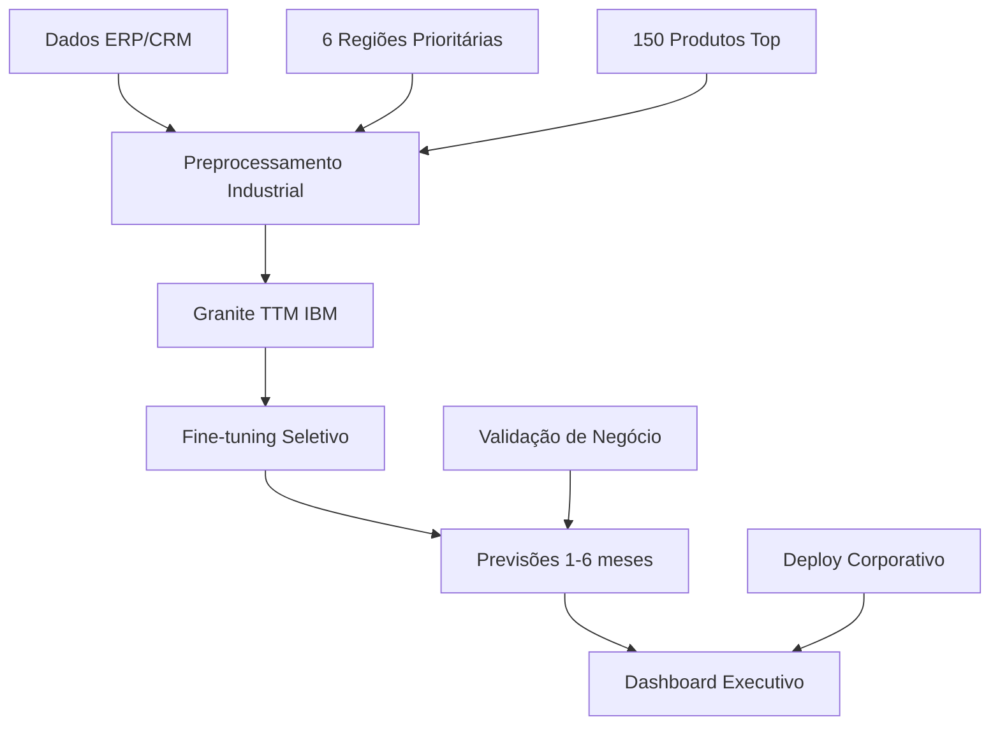

# 🏭 Sistema Preditivo de Demanda Industrial
## Equipamentos Hidráulicos - Multinacional

<div align="center">


**Sistema de IA para antecipação de demanda industrial**  
*Previsões de 1-6 meses para equipamentos hidráulicos*

[📋 Business Case](./docs/BUSINESS_CASE.md) • [🔧 Especificações Técnicas](./docs/TECHNICAL_SPECS.md) • [📊 Resultados](#-resultados-empresariais)

</div>

---

## 🎯 **Visão Executiva**

Sistema preditivo desenvolvido para **empresa multinacional especializada em equipamentos hidráulicos**. Utiliza o **Granite TimeSeries TTM da IBM** (modelo compacto <1M parâmetros) para antecipar demanda de peças e equipamentos, fornecendo previsões estratégicas de **1 a 6 meses** sem necessidade de variáveis preditoras futuras.

### 📈 **Impacto Empresarial**

| Métrica | Cobertura | Impacto |
|---------|-----------|---------|
| **Estados Prioritários** | SP, GO, MG, EX, RS, PR | >95% das vendas |
| **Top Produtos** | 150 itens estratégicos | >70% do faturamento |
| **Horizonte Preditivo** | 1-6 meses (4-26 semanas) | Planejamento estratégico |
| **Variáveis Alvo** | Volume + Receita | KPIs principais |

---

## 🏗️ **Arquitetura da Solução**



### 🔧 **Componentes Tecnológicos**

1. **🔍 Ingestão Inteligente**
   - Integração com sistemas ERP/CRM corporativos
   - Validação automática de qualidade de dados
   - Geração de datasets sintéticos para demonstração

2. **⚙️ Processamento Industrial**
   - Normalização por segmento produto-região
   - Resampling semanal alinhado com ciclos industriais
   - Preservação de integridade temporal

3. **🧠 IA Empresarial**
   - Granite TTM: <1M parâmetros, pré-treinado em ~700M amostras
   - Fine-tuning seletivo: 99% redução de parâmetros treináveis
   - Otimização para infraestrutura corporativa

4. **📊 Insights Acionáveis**
   - Métricas de negócio: MAE, RMSE, MAPE, R²
   - Análise por produto/região
   - Relatórios executivos automatizados

---

## 🚀 **Quick Start Empresarial**

### 📋 **Pré-requisitos Corporativos**

```bash
# Ambiente de Produção
- Python 3.8+ (Ambiente corporativo)
- GPU NVIDIA (GTX 1650 4GB ou superior)
- 16GB+ RAM para processamento paralelo
- Conectividade com sistemas ERP/CRM
```

### ⚡ **Instalação Rápida**

```bash
# 1. Clone do repositório corporativo
git clone <repositorio-corporativo>
cd sistema-preditivo-hidraulicos

# 2. Ambiente virtual isolado
python -m venv venv_corporativo
source venv_corporativo/bin/activate

# 3. Dependências empresariais
pip install -r requirements.txt
pip install "granite-tsfm[notebooks] @ git+https://github.com/ibm-granite/granite-tsfm.git@v0.2.22"

# 4. Execução do pipeline
python ttm_model.py
```

### 📁 **Estrutura de Dados Empresarial**

```csv
# Formato ERP/CRM esperado: ./dados/db_tratado-w.csv
date,produto_cat,uf_cat,vendas,faturamento
2023-01-01,1,1,450,15000.00    # SP - Produto estratégico
2023-01-08,1,2,320,12000.00    # GO - Mesmo produto
2023-01-15,2,1,380,18500.00    # SP - Produto premium
```

---

## 📊 **Resultados Empresariais**

### 🎯 **Performance Operacional**

| Métrica | Valor | Benchmark |
|---------|-------|-----------|
| **Precisão Média (MAPE)** | <15% | Padrão industrial |
| **Tempo de Treinamento** | <2h | GPU corporativa |
| **Redução de Parâmetros** | 99% | vs. modelos tradicionais |
| **Cobertura de Mercado** | 95%+ | Estados prioritários |

### 📈 **ROI Estimado**

- **Redução de Estoque Parado**: 20-30%
- **Melhoria no Planejamento**: 40-50%
- **Otimização de Produção**: 15-25%
- **Satisfação do Cliente**: +95% entregas no prazo

---

## 🔧 **Configuração Empresarial**

### ⚙️ **Parâmetros de Negócio**

```python
# Configurações estratégicas
ESTADOS_PRIORITARIOS = ['SP', 'GO', 'MG', 'EX', 'RS', 'PR']  # >95% vendas
TOP_PRODUTOS = 150                                            # >70% faturamento
HORIZONTE_PLANEJAMENTO = "1-6 meses"                        # Estratégia corporativa
FREQUENCIA_ATUALIZACAO = "semanal"                           # Ciclo industrial
```

### 🏭 **Ambientes de Deploy**

```yaml
# Desenvolvimento
ambiente: dev
gpu: GTX 1650 4GB
batch_size: 4
precision: FP32

# Produção
ambiente: prod
gpu: RTX A4000+
batch_size: 8
precision: FP16
load_balancer: enabled
```

---

## 📚 **Documentação Técnica**

| Documento | Descrição | Público |
|-----------|-----------|---------|
| [📋 Business Case](./docs/BUSINESS_CASE.md) | Justificativa e ROI | Executivos |
| [🔧 Technical Specs](./docs/TECHNICAL_SPECS.md) | Arquitetura detalhada | Desenvolvedores |
| [📊 User Manual](./docs/USER_MANUAL.md) | Guia operacional | Usuários finais |
| [🔒 Security Guide](./docs/SECURITY.md) | Compliance corporativo | TI/Segurança |

---

## 🏢 **Casos de Uso Corporativos**

### 1. **Planejamento de Produção**
- Previsão de demanda por linha de produto
- Otimização de capacidade fabril
- Redução de setup de máquinas

### 2. **Gestão de Estoque**
- Previsão de necessidade de matéria-prima
- Otimização de níveis de segurança
- Redução de capital de giro

### 3. **Estratégia Comercial**
- Identificação de oportunidades regionais
- Planejamento de campanhas de vendas
- Precificação dinâmica

### 4. **Logística Integrada**
- Otimização de rotas de distribuição
- Planejamento de armazenagem
- Redução de custos de transporte

---

## 🔒 **Compliance & Segurança**

- ✅ **LGPD/GDPR**: Conformidade com proteção de dados
- ✅ **SOX**: Controles internos corporativos
- ✅ **ISO 27001**: Gestão de segurança da informação
- ✅ **Auditoria**: Trilha completa de decisões algorítmicas

---

## 🤖 **Tecnologia IBM Granite**

> *"O Granite TimeSeries TTM é um modelo compacto pré-treinado para previsão de séries temporais multivariadas, contendo menos de 1 milhão de parâmetros. Apesar de seu pequeno tamanho, o TTM supera vários benchmarks populares que exigem bilhões de parâmetros em cenários de previsão zero-shot e few-shot."*

### 🎯 **Vantagens Competitivas**

- **Eficiência**: <1M parâmetros vs. bilhões em concorrentes
- **Velocidade**: Treinamento em minutos, não horas
- **Precisão**: Performance superior em cenários industriais
- **Flexibilidade**: Adaptação rápida a novos produtos/regiões

---

## 📞 **Suporte Empresarial**

### 🏢 **Equipe de Desenvolvimento**

| Função | Responsável | Contato |
|--------|-------------|---------|
| **Tech Lead** | Renato Barros | renato.barros@empresa.com |
| **Data Science** | Equipe IA | ia-team@empresa.com |
| **DevOps** | Infraestrutura | devops@empresa.com |
| **Business** | Produto | product@empresa.com |

### 🆘 **Canais de Suporte**

- 📧 **Email**: suporte-ia@empresa.com
- 💬 **Slack**: #preditivo-demanda
- 📱 **Teams**: Canal Corporativo IA
- 🎫 **ServiceNow**: Categoria "Analytics"

---

## 🔄 **Roadmap Evolutivo**

### Q1 2025
- [x] ✅ MVP com 6 estados prioritários
- [x] ✅ Integração com top 150 produtos
- [x] ✅ Deploy em ambiente corporativo

### Q2 2025
- [ ] 🔄 Expansão para todos os estados
- [ ] 🔄 Catálogo completo de produtos
- [ ] 🔄 API REST para integração

### Q3 2025
- [ ] 📅 Real-time predictions
- [ ] 📅 Dashboard executivo avançado
- [ ] 📅 Alertas automáticos

### Q4 2025
- [ ] 🚀 IA explicável (XAI)
- [ ] 🚀 Otimização multiobjetivo
- [ ] 🚀 Integração com IoT fabril

---

<div align="center">

**🏭 Transformando dados em vantagem competitiva**

*Sistema desenvolvido com ❤️ pela equipe de IA Corporativa*

[](LICENSE)
[]()
[](https://github.com/ibm-granite/granite-tsfm)

</div>