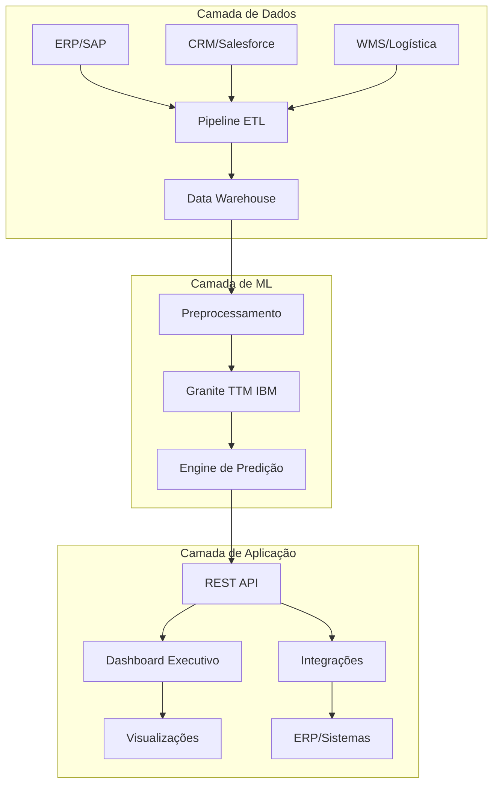

# 🔧 Especificações Técnicas - Sistema Preditivo Industrial

## 🏗️ **Arquitetura da Solução**

### **Visão Geral do Sistema**



---

## 🤖 **Modelo de Machine Learning**

### **IBM Granite TimeSeries TTM**

#### **Especificações do Modelo**
| Característica | Valor | Descrição |
|----------------|-------|-----------|
| **Arquitetura** | TinyTimeMixer | Transformer compacto para séries temporais |
| **Parâmetros** | <1M | Ultra-eficiente vs. modelos tradicionais |
| **Pré-treinamento** | ~700M amostras | Datasets públicos globais |
| **Context Length** | 104 semanas | 2 anos de histórico semanal |
| **Prediction Length** | 26 semanas | 6 meses de horizonte |
| **Input Channels** | 2 | Vendas + Faturamento |
| **Categorical Variables** | 1 | Região (SP,GO,MG,EX,RS,PR) |

#### **Configuração Técnica**

```python
# Configuração do Modelo TTM
TinyTimeMixerConfig(
    context_length=104,                    # Janela histórica
    prediction_length=26,                  # Horizonte preditivo
    num_input_channels=2,                  # Vendas + Faturamento
    decoder_mode="mix_channel",            # Modo multivariate
    categorical_vocab_size_list=[6],       # 6 regiões
    prediction_channel_indices=[0, 1],     # Ambos canais como target
    freq="W"                              # Frequência semanal
)
```

#### **Fine-tuning Strategy**

**Selective Fine-tuning:**
- ❄️ **Camadas Congeladas**: Encoder completo (99% parâmetros)
- 🔥 **Camadas Treináveis**: Apenas FC1 e FC2 (1% parâmetros)
- ⚡ **Benefícios**: 50x mais rápido, menor overfitting
- 💾 **Memória**: Redução de 90% uso GPU

```python
# Implementação do Fine-tuning Seletivo
def setup_selective_fine_tuning(model):
    # Congelar encoder
    for param in model.parameters():
        param.requires_grad = False
    
    # Descongelar apenas FC layers
    for name, module in model.named_modules():
        if 'fc1' in name or 'fc2' in name:
            for param in module.parameters():
                param.requires_grad = True
```

---

## 📊 **Pipeline de Dados**

### **Fluxo de Processamento**

#### **1. Ingestão de Dados**
```python
# Fontes de Dados Corporativas
SOURCES = {
    'ERP': 'SAP/Oracle',           # Vendas, estoque, produção
    'CRM': 'Salesforce',           # Pipeline comercial
    'WMS': 'Manhattan/SAP',        # Logística, distribuição
    'External': 'APIs terceiros'   # Indicadores econômicos
}

# Estrutura de Dados
SCHEMA = {
    'timestamp': 'datetime',       # Data da transação
    'produto_cat': 'int',          # ID produto (1-150)
    'uf_cat': 'int',              # Região (1-6)
    'vendas': 'float',            # Volume vendido
    'faturamento': 'float'        # Receita em R$
}
```

#### **2. Transformação e Limpeza**
```python
# Pipeline de Preprocessamento
class DataPreprocessor:
    def __init__(self):
        self.scaler = StandardScaler()
        self.encoder = LabelEncoder()
    
    def process(self, df):
        # Resampling para frequência semanal
        df_weekly = self.resample_weekly(df)
        
        # Normalização por grupo produto-região
        df_scaled = self.scale_by_group(df_weekly)
        
        # Codificação categórica
        df_encoded = self.encode_categories(df_scaled)
        
        return df_encoded
```

#### **3. Validação de Qualidade**
```python
# Regras de Validação
VALIDATION_RULES = {
    'completeness': 'Missing < 5%',
    'consistency': 'No negative values',
    'timeliness': 'Data freshness < 1 week',
    'accuracy': 'Outliers < 2%'
}
```

---

## 🏭 **Infraestrutura e Deploy**

### **Arquitetura de Sistema**

#### **Ambiente de Desenvolvimento**
```yaml
development:
  compute:
    cpu: Intel i7-9700K
    gpu: NVIDIA GTX 1650 4GB
    ram: 32GB DDR4
    storage: 1TB NVMe SSD
  
  software:
    os: Ubuntu 20.04 LTS
    python: 3.8+
    cuda: 11.8+
    pytorch: 2.0+
```

#### **Ambiente de Produção**
```yaml
production:
  infrastructure:
    provider: AWS/Azure
    region: us-east-1 / Brazil South
    availability_zones: 2+
  
  compute:
    instance: p3.2xlarge / Standard_NC6s_v3
    gpu: NVIDIA V100 16GB / K80
    cpu: 8 vCPUs
    ram: 61GB
    storage: 500GB EBS/Premium SSD
  
  networking:
    vpc: Dedicated VPC
    subnets: Private + Public
    load_balancer: Application Load Balancer
    cdn: CloudFront / Azure CDN
```

#### **Containerização**
```dockerfile
# Dockerfile para Produção
FROM nvidia/cuda:11.8-runtime-ubuntu20.04

# Dependências Python
COPY requirements.txt .
RUN pip install -r requirements.txt

# Código da aplicação
COPY src/ /app/
WORKDIR /app

# Configuração CUDA
ENV CUDA_VISIBLE_DEVICES=0
ENV NVIDIA_VISIBLE_DEVICES=all

# Health check
HEALTHCHECK CMD curl -f http://localhost:8000/health

EXPOSE 8000
CMD ["gunicorn", "--bind", "0.0.0.0:8000", "app:main"]
```

#### **Orquestração Kubernetes**
```yaml
apiVersion: apps/v1
kind: Deployment
metadata:
  name: ttm-predictor
spec:
  replicas: 3
  selector:
    matchLabels:
      app: ttm-predictor
  template:
    spec:
      containers:
      - name: ttm-predictor
        image: empresa/ttm-predictor:latest
        resources:
          requests:
            nvidia.com/gpu: 1
            memory: "8Gi"
            cpu: "2"
          limits:
            nvidia.com/gpu: 1
            memory: "16Gi"
            cpu: "4"
```

---

## 🔧 **APIs e Integrações**

### **REST API Specification**

#### **Endpoint de Predição**
```python
@app.post("/predict")
async def predict_demand(request: PredictionRequest):
    """
    Gera previsões de demanda para produto/região específicos
    
    Parameters:
    - produto_id: int (1-150)
    - regiao_id: int (1-6) 
    - horizon: int (1-26 semanas)
    - confidence_interval: bool
    
    Returns:
    - predictions: List[float]
    - confidence_bounds: Optional[Tuple[float, float]]
    - metadata: dict
    """
    
    # Validação de entrada
    validate_request(request)
    
    # Carregamento do modelo
    model = load_model(request.modelo_version)
    
    # Preprocessamento
    input_data = preprocess(request.data)
    
    # Inferência
    predictions = model.predict(input_data)
    
    # Pós-processamento
    results = postprocess(predictions, request.params)
    
    return PredictionResponse(**results)
```

#### **Endpoints Principais**

| Endpoint | Método | Descrição |
|----------|--------|-----------|
| `/predict` | POST | Predição individual |
| `/predict/batch` | POST | Predição em lote |
| `/models` | GET | Lista modelos disponíveis |
| `/health` | GET | Status do serviço |
| `/metrics` | GET | Métricas de performance |

### **Integração com ERP/CRM**

#### **SAP Integration**
```python
class SAPConnector:
    def __init__(self, config):
        self.client = pyrfc.Connection(**config)
    
    def extract_sales_data(self, date_range):
        """Extração de dados de vendas do SAP"""
        result = self.client.call('RFC_READ_TABLE', 
                                  QUERY_TABLE='VBAK',
                                  FIELDS=['VBELN', 'ERDAT', 'NETWR'])
        return self.transform_sap_data(result)
```

#### **Salesforce Integration**
```python
class SalesforceConnector:
    def __init__(self, config):
        self.client = Salesforce(**config)
    
    def get_opportunities(self, date_range):
        """Extração de pipeline comercial"""
        query = f"""
        SELECT ProductCode, Territory, Amount, CloseDate 
        FROM Opportunity 
        WHERE CloseDate >= {date_range.start}
        """
        return self.client.query(query)
```

---

## 📈 **Monitoramento e Observabilidade**

### **Métricas de Sistema**

#### **Performance Metrics**
```python
# Métricas de Latência
LATENCY_METRICS = {
    'prediction_latency_p50': 'Latência mediana',
    'prediction_latency_p95': 'Latência 95th percentil',
    'prediction_latency_p99': 'Latência 99th percentil'
}

# Métricas de Throughput
THROUGHPUT_METRICS = {
    'predictions_per_second': 'RPS de predições',
    'batch_processing_time': 'Tempo batch completo',
    'concurrent_requests': 'Requisições simultâneas'
}
```

#### **Model Performance Metrics**
```python
# Métricas de Acurácia
ACCURACY_METRICS = {
    'mae_rolling_30d': 'MAE últimos 30 dias',
    'mape_by_product': 'MAPE por produto',
    'r2_by_region': 'R² por região',
    'prediction_drift': 'Drift das predições'
}

# Alertas Automáticos
ALERTS = {
    'accuracy_degradation': 'MAPE > 20%',
    'data_drift': 'Mudança distribuição > 15%',
    'model_latency': 'Latência > 2s',
    'error_rate': 'Taxa erro > 5%'
}
```

#### **Dashboards**

**Grafana Dashboards:**
- 📊 **Operational**: Latência, throughput, errors
- 🎯 **Model Performance**: Acurácia, drift, bias
- 📈 **Business KPIs**: Vendas preditas vs. reais
- 🏭 **Infrastructure**: GPU, CPU, memória

---

## 🔒 **Segurança e Compliance**

### **Data Security**

#### **Encryption**
```python
# Criptografia em Repouso
ENCRYPTION_AT_REST = {
    'algorithm': 'AES-256',
    'key_management': 'AWS KMS / Azure Key Vault',
    'data_stores': ['S3', 'RDS', 'ElasticSearch']
}

# Criptografia em Trânsito
ENCRYPTION_IN_TRANSIT = {
    'protocol': 'TLS 1.3',
    'certificates': 'Let\'s Encrypt / Corporate CA',
    'endpoints': 'All API communications'
}
```

#### **Access Control**
```python
# RBAC (Role-Based Access Control)
ROLES = {
    'data_scientist': ['read_models', 'train_models'],
    'business_user': ['read_predictions', 'view_dashboards'],
    'admin': ['all_permissions'],
    'readonly': ['view_dashboards']
}

# OAuth 2.0 + JWT
AUTH_CONFIG = {
    'provider': 'Azure AD / Okta',
    'token_expiry': '1 hour',
    'refresh_token': '30 days',
    'mfa': 'required'
}
```

### **Data Privacy (LGPD/GDPR)**

#### **Privacy by Design**
```python
# Anonimização de Dados
ANONYMIZATION = {
    'customer_data': 'SHA-256 hashing',
    'location_data': 'Geographic aggregation',
    'temporal_data': 'Time bucketing'
}

# Auditoria de Acesso
AUDIT_LOG = {
    'events': ['data_access', 'model_prediction', 'config_change'],
    'retention': '7 years',
    'storage': 'Immutable audit trail'
}
```

---

## 🚀 **Performance e Otimização**

### **Model Optimization**

#### **Inference Optimization**
```python
# Model Quantization
QUANTIZATION = {
    'precision': 'FP16',           # Half precision
    'dynamic': True,               # Dynamic quantization
    'calibration': 'Post-training' # PTQ vs QAT
}

# Model Compilation
COMPILATION = {
    'framework': 'TorchScript',    # JIT compilation
    'optimization': 'O2',          # Optimization level
    'target': 'CUDA'              # Target device
}

# Batch Processing
BATCHING = {
    'max_batch_size': 32,
    'timeout': '100ms',
    'padding': 'dynamic'
}
```

#### **GPU Optimization**
```python
# Memory Management
GPU_CONFIG = {
    'memory_fraction': 0.8,        # 80% GPU memory
    'memory_growth': True,         # Dynamic allocation
    'mixed_precision': True        # AMP (Automatic Mixed Precision)
}

# Parallel Processing
PARALLELIZATION = {
    'data_parallel': True,         # Multi-GPU data parallel
    'pipeline_parallel': False,    # Single model fits in 1 GPU
    'tensor_parallel': False       # Model not large enough
}
```

### **Scalability Architecture**

#### **Horizontal Scaling**
```yaml
# Auto Scaling Configuration
auto_scaling:
  min_replicas: 2
  max_replicas: 10
  metrics:
    - type: Resource
      resource:
        name: cpu
        target:
          type: Utilization
          averageUtilization: 70
    - type: Pods
      pods:
        metric:
          name: requests_per_second
        target:
          type: AverageValue
          averageValue: "100"
```

#### **Load Balancing**
```python
# Intelligent Load Balancing
LOAD_BALANCER = {
    'algorithm': 'least_connections',  # GPU-aware routing
    'health_checks': 'GPU availability',
    'session_affinity': False,         # Stateless design
    'timeout': '30s'
}
```

---

## 📋 **Deployment e CI/CD**

### **Pipeline de Deploy**

#### **GitOps Workflow**
```yaml
# .github/workflows/deploy.yml
name: Deploy TTM Model
on:
  push:
    branches: [main]
    paths: ['src/**', 'models/**']

jobs:
  test:
    runs-on: ubuntu-latest
    steps:
      - uses: actions/checkout@v2
      - name: Run Tests
        run: |
          pytest tests/
          python -m model_tests.accuracy_test
  
  build:
    needs: test
    runs-on: ubuntu-latest
    steps:
      - name: Build Docker Image
        run: docker build -t ttm-predictor:${{ github.sha }} .
      
      - name: Push to Registry
        run: docker push ttm-predictor:${{ github.sha }}
  
  deploy:
    needs: build
    runs-on: ubuntu-latest
    steps:
      - name: Deploy to K8s
        run: |
          kubectl set image deployment/ttm-predictor \
            ttm-predictor=ttm-predictor:${{ github.sha }}
```

#### **Model Versioning**
```python
# MLflow Model Registry
class ModelRegistry:
    def __init__(self):
        self.client = MlflowClient()
    
    def register_model(self, model_path, metrics):
        """Registra novo modelo com versionamento"""
        model_version = self.client.create_model_version(
            name="ttm-demand-predictor",
            source=model_path,
            description=f"Acurácia: {metrics['accuracy']:.3f}"
        )
        return model_version
    
    def promote_to_production(self, version):
        """Promove modelo para produção"""
        self.client.transition_model_version_stage(
            name="ttm-demand-predictor",
            version=version,
            stage="Production"
        )
```

---

## 🔍 **Testing Strategy**

### **Test Pyramid**

#### **Unit Tests**
```python
# tests/test_preprocessing.py
class TestDataPreprocessor:
    def test_weekly_resampling(self):
        """Testa resampling semanal"""
        daily_data = generate_daily_data()
        weekly_data = resample_weekly(daily_data)
        assert len(weekly_data) == expected_weeks
    
    def test_normalization(self):
        """Testa normalização por grupo"""
        raw_data = load_test_data()
        normalized = normalize_by_group(raw_data)
        assert normalized.mean() < 0.1
```

#### **Integration Tests**
```python
# tests/test_model_integration.py
class TestModelIntegration:
    def test_end_to_end_prediction(self):
        """Testa pipeline completo"""
        input_data = load_sample_data()
        prediction = model_pipeline.predict(input_data)
        assert prediction.shape == expected_shape
        assert not np.isnan(prediction).any()
```

#### **Performance Tests**
```python
# tests/test_performance.py
class TestPerformance:
    def test_prediction_latency(self):
        """Testa latência de predição"""
        start_time = time.time()
        prediction = model.predict(sample_input)
        latency = time.time() - start_time
        assert latency < 0.5  # Menos de 500ms
```

---

## 📞 **Suporte e Manutenção**

### **Runbooks Operacionais**

#### **Troubleshooting Guide**
```bash
# Diagnóstico de Problemas Comuns

# 1. Verificar saúde do modelo
curl -f http://api.empresa.com/health

# 2. Verificar métricas de acurácia
kubectl logs deployment/ttm-predictor | grep "accuracy"

# 3. Reiniciar serviço em caso de erro
kubectl rollout restart deployment/ttm-predictor

# 4. Verificar uso de GPU
nvidia-smi

# 5. Monitorar logs em tempo real
kubectl logs -f deployment/ttm-predictor
```

#### **Escalation Matrix**
| Severidade | Tempo Resposta | Responsável | Ação |
|------------|----------------|-------------|------|
| **P0 - Critical** | 15 min | On-call engineer | Immediate fix |
| **P1 - High** | 2 hours | Tech lead | Same day resolution |
| **P2 - Medium** | 1 day | Team | Next sprint |
| **P3 - Low** | 1 week | Product owner | Backlog |

---

<div align="center">

**🔧 Especificações validadas pela equipe de arquitetura**

*Documento versionado: v2.1*  
*Última atualização: 23/06/2025*

</div>